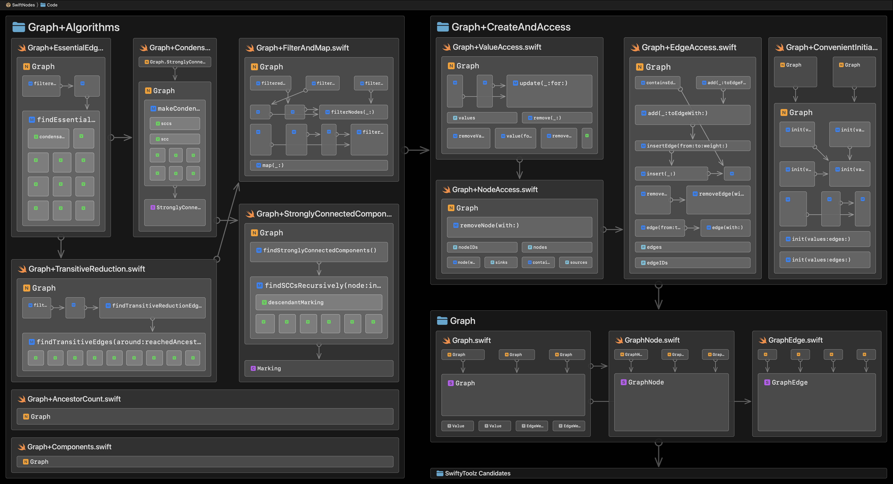

# SwiftNodes

👩🏻‍🚀 *This project [is still a tad experimental](#development-status). Contributors and pioneers welcome!*

## What?

SwiftNodes provides a `Graph` data structure and graph algorithms. A `Graph` stores values in nodes which can be connected by edges. SwiftNodes was first used in production by [Codeface](https://codeface.io).

## How to Edit, Query and Copy Graphs

The following explanations only touch parts of the SwiftNodes API. We recommend exploring the comments, code and unit tests of SwiftNodes. The code in particular is actually very small and easy to grasp.

### Insert Values

A `Graph<NodeID: Hashable, NodeValue>` holds values of type `NodeValue` in nodes. Nodes are unique and have IDs of type `NodeID`:

```swift
let graph = Graph<String, Int> { "id\($0)" }  // NodeID == String, NodeValue == Int
let node = graph.insert(1)                    // node.id == "id1", node.value == 1

let nodeForID1 = graph.node(for: "id1")       // nodeForID1 === node
let valueForID1 = graph.value(for: "id1")     // valueForID1 == 1
```

When inserting a value, a `Graph` must know how to generate the ID of the node that would store the value. So the initializer takes a closure returning a `NodeID` given a `NodeValue`.

### Generate Node IDs

You may generate the `NodeID` independent of the `NodeValue`:

```swift
let graph = Graph<UUID, Int> { _ in UUID() }  // NodeID == UUID, NodeValue == Int
let node1 = graph.insert(42)
let node2 = graph.insert(42)  // node1 !== node2, same value in different nodes
```

If `NodeID` and `NodeValue` are the same type, you can omit the closure and the `Graph` will assume the value is itself used as the node ID:

```swift
let graph = Graph<Int, Int>()  // NodeID == NodeValue == Int
let node1 = graph.insert(42)   // node1.value == node1.id == 42
let node2 = graph.insert(42)   // node1 === node2 because 42 implies the same ID
```

And if your `NodeValue` is itself `Identifiable` by IDs of type `NodeID`, then you can also omit the closure and `Graph` will use the `ID` of a `NodeValue` for the node holding that value:

```swift
struct IdentifiableValue: Identifiable { let id = UUID() }
let graph = Graph<UUID, IdentifiableValue>()  // NodeID == NodeValue.ID == UUID
let node = graph.insert(IdentifiableValue())  // node.id == node.value.id
```

### Connect Nodes via Edges

```swift
let graph = Graph<String, Int> { "id\($0)" }
let node1 = graph.insert(1)
let node2 = graph.insert(2)

// two ways to add an edge:
let edge = graph.addEdge(from: node1,  to: node2)
let edge = graph.addEdge(from: node1.id,  to: node2.id)
  
// same result: edge.origin === node1, edge.destination === node2
```

### Specify Edge Counts

Every `edge` has an integer count accessible via `edge.count`. It is more specifically a "count" rather than a "weight", as it inceases when the same edge is added again. By default, a new edge has count 1 and adding it again increases the count by 1. But you can specify different counts when adding an edge:

```swift
graph.addEdge(from: node1, to: node2, count: 40)  // edge count is 40
graph.addEdge(from: node1, to: node2, count: 2)   // edge count is 42
```

### Remove Edges

A `GraphEdge<NodeID: Hashable, NodeValue>` has its own `ID` type which combines the `NodeID`s of the edge's origin- and destination nodes. In the context of a `Graph` or `GraphEdge`, you can create edge IDs easily in two ways:

```swift
let edgeID_A = Edge.ID(node1, node2)
let edgeID_B = Edge.ID(node1.id, node2.id)  // edgeID_A == edgeID_B
```

This leads to six ways of removing an edge:

```swift
let edge = graph.addEdge(from: node1, to: node2)

graph.remove(edge)
graph.removeEdge(with: edge.id)
graph.removeEdge(with: .init(node1, node2))
graph.removeEdge(with: .init(node1.id, node2.id))
graph.removeEdge(from: node1, to: node2)
graph.removeEdge(from: node1.id, to: node2.id)
```

### Query and Traverse a Graph

`Graph` offers many ways to query its nodes, node IDs, values and edges. Have a look into [Graph.swift](https://github.com/codeface-io/SwiftNodes/blob/master/Code/Graph/Graph.swift) to see them all. In addition,  `GraphNode` has caches that enable quick access to its neighbours:

```swift
node.descendants  // all nodes to which there is an edge from node
node.ancestors    // all nodes from which there is an edge to node
node.neighbours   // all descendants and ancestors
node.isSink       // whether node has no descendants
node.isSource     // whether node has no ancestors
```

### Sort Nodes

The nodes in a `Graph` maintain an order. So you can also sort them:

```swift
let graph = Graph<Int, Int>()  // NodeID == NodeValue == Int
graph.insert(5)
graph.insert(3)                // graph.values == [5, 3]
graph.sort { $0.id < $1.id }   // graph.values == [3, 5]
```

### Copy a Graph

Many algorithms produce a variant of a given graph. Rather than modifying the original graph, SwiftNodes suggests to copy it.

A `graph.copy()` is identical to the original `graph` in IDs, values and structure but contains its own new node- and edge objects. You may also copy just a subset of a graph and limit the included edges and/or nodes:

```swift
let subsetCopy = graph.copy(includedNodes: [node2, node3], 
                            includedEdges: [edge23])
```

## How to Write Graph Algorithms

To support algorithms, every `node` has an optional property `node.marking` which can store a `GraphNode.Marking` object. A marking can be used to generally mark a node, but it also has two integers and two boolean flags that algorithms can use in whatever way they need.

[Graph+Node.Marking.swift](https://github.com/codeface-io/SwiftNodes/blob/master/Code/Graph%2BAlgorithms/Graph%2BNode.Marking.swift) contains some conveniences for marking and unmarking nodes. Also have a look at how the [included algorithms](https://github.com/codeface-io/SwiftNodes/tree/master/Code/Graph%2BAlgorithms) make use of node markings.

## Included Algorithms

SwiftNodes has begun to accumulate [some graph algorithms](https://github.com/codeface-io/SwiftNodes/tree/master/Code/Graph%2BAlgorithms). The following overview also links to Wikipedia articles that explain what the algorithms do. We recommend also exploring them in code.

### Components

`graph.findComponents()`  returns multiple sets of nodes which represent the [components](https://en.wikipedia.org/wiki/Component_(graph_theory)) of the `graph`.

### Strongly Connected Components

`graph.findStronglyConnectedComponents()`  returns multiple sets of nodes which represent the [strongly connected components](https://en.wikipedia.org/wiki/Strongly_connected_component) of the `graph`.

### Condensation Graph

`graph.makeCondensationGraph()` creates the [condensation graph](https://en.wikipedia.org/wiki/Strongly_connected_component) of the `graph`, which is the graph in which all [strongly connected components](https://en.wikipedia.org/wiki/Strongly_connected_component) of the original `graph` have been collapsed into single nodes, so the resulting condensation graph is acyclic.

### Minimum Equivalent Graph

`graph.makeMinimumEquivalentGraph()` creates the [MEG](https://en.wikipedia.org/wiki/Transitive_reduction) of the `graph`. This only works on acyclic graphs and might even hang or crash on cyclic ones.

### Ancestor Counts

`graph.findNumberOfNodeAncestors()` returns a `[(Node, Int)]` containing each node of the `graph` together with its ancestor count. The ancestor count is the number of all (recursive) ancestors of the node. Basically, it's the number of other nodes from which the node can be reached. 

This only works on acyclic graphs right now and might return incorrect results for nodes in cycles.

Ancestor counts can serve as a proxy for [topological sorting](https://en.wikipedia.org/wiki/Topological_sorting).

## Architecture

Here is the internal architecture (composition and essential dependencies) of the SwiftNodes code folder:



The above image was created with [Codeface](https://codeface.io).

## Development Status

From version/tag 0.1.0 on, SwiftNodes adheres to [semantic versioning](https://semver.org). So until it has reached 1.0.0, its API may still break frequently, but this will be expressed in version bumps.

SwiftNodes is already being used in production, but [Codeface](https://codeface.io) is still its primary client. SwiftNodes will move to version 1.0.0 as soon as its basic practicality and conceptual soundness have been validated by serving multiple real-world clients.
